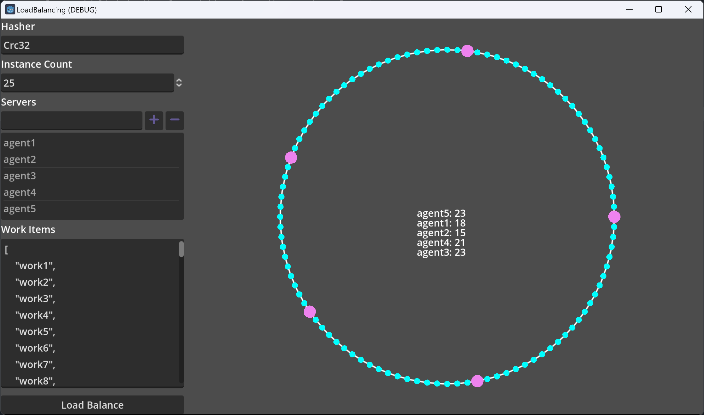
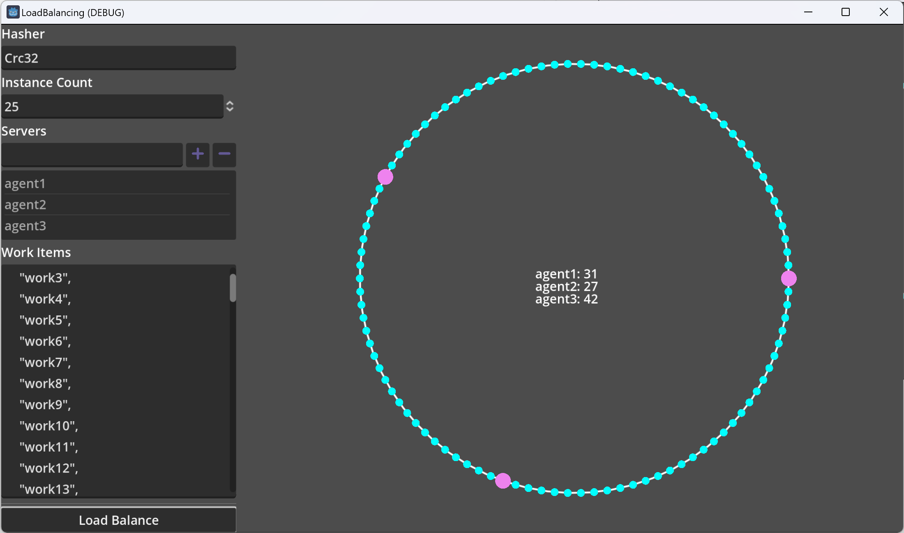
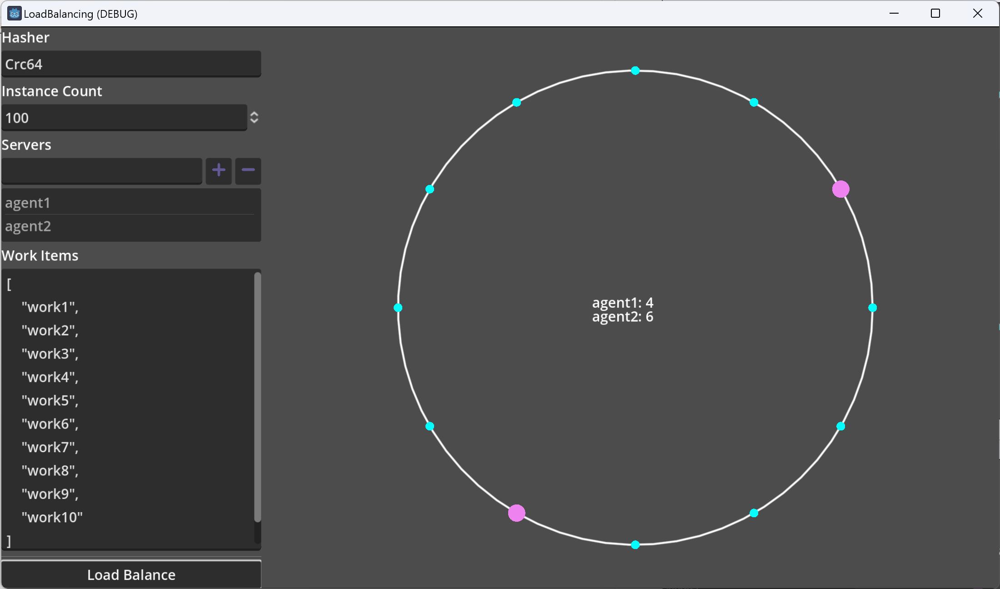

# Load Balancing

A simple, single class, dotnet 6.0+ implementation of a consistent hash-based load balancer.

The basic goal of this is to make the load balancing of work predictable as workers are added and removed.

The implementation is loosely based on the ideas presented in [this YouTube video](https://www.youtube.com/watch?v=UF9Iqmg94tk).

If you are solely interested in the hash ring implementation, take a look at [`ConsistentHashRing.cs`](https://github.com/rimrock-labs/load-balancing/blob/main/src/load-balancing/ConsistentHashRing.cs).

Otherwise, this repository includes a Godot UI sample to test various scenarios, and allows you to visualize the impact of different hashing implementations, number of agents and work involved.

The UI is prepopulated with sane defaults for you to test with.

Here are some examples,

